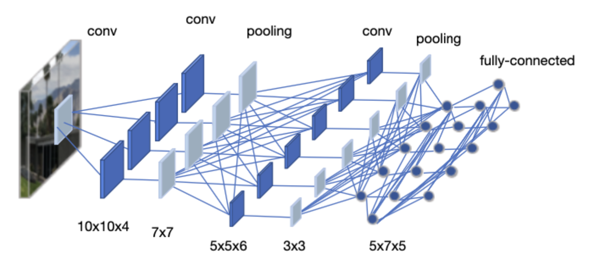

# Neural networks
* In this lecture, we will learn the basics of the neural network (NN).

## Perceptron
* The perceptron is one of the simplest artificial neural network (ANN) archtechtures.
* It is based on a artificial neuron called a linear threshold unit (LTU): the inputs and output are numbers and each input connection is associated with a weight $w$.
* The LTU computes a weighted sum of its inputs ($z = w_1x_1 + w_2x_2 + \cdots + w_n x_n = {\bf w}^T\cdot{\bf x}$), then applies a step function to sum and outputs the result: $h_w({\bf x}) = {\rm step}(z) = {\rm step}({\bf w}^T\cdot{\bf x})$.
* Common step function used in perceptrons are 

$$
\begin{align*}
{\rm heaviside}(z)= \left\{
    \begin{matrix}
        0 \hspace{15pt}\text{if}\hspace{5pt}z \lt 0 \\
        1 \hspace{15pt}\text{if}\hspace{5pt}z \ge 0
    \end{matrix}
\right.
\\
\\
{\rm sgn}(z)= \left\{
    \begin{matrix}
        -1 \hspace{15pt}\text{if}\hspace{5pt}z \lt 0 \\
         0 \hspace{15pt}\text{if}\hspace{5pt}z = 0 \\
         1 \hspace{15pt}\text{if}\hspace{5pt}z \gt 0
    \end{matrix}
\right.
\end{align*}
$$

* A single LTU can be used for simple linear binary classification. It computes a linear combination of the inputs and if the result exceeds a threshold. Otherwise it outputs the positive class or else outputs the negative class.
* For example, you can use a single LTU to classify iris flowers based on the petal length and width. Training an LTU means finding the right values for weights $w_0$, $w_1$, and $w_2$.

### Multi-layer perceptron
* An multi-layer perceptron (MLP) typically has a following architechture: one (passthrough) input layer, one or more layers of LTUs (called *hidden layers*), and one final layer of the LTUs (called the output layer).
* Every layer except the output layer includes a bias neuron and is fully connected to the next layer. When an ANN has two or more hidden layers, it is called a *deep neutral network*.

### Backpropagation
* For many years, researchers struggled to find a way to train MLPs, without success. But in 1986, D. E. Rumelhart et al. published a groundbreaking article introducing the backpropagation training algorithm.
* For each training instance, the algorithm feeds it to the network and coumputes the output of every neuron in each consective layer.
* Then it measures the network's output error (i.e. the difference between the desired output and the actual output 
  of the network). The error is measured by the **loss function**.
* It computes how much each neuron in the last hidden layer contributed to the output. Similarly, contributions to the output from neurons in the hidden layer can be measured.
* This reverse pass efficiently measures the error gradient across all the connection weights in the network by propagating the error gradient backward in the network.

### Activation function
* In order for the backpropagation to work properly, the authors made a key change to the MLP's archtecture: they replaced the step function with the sigmoid function, $\sigma(z) = 1/(1+\exp(-z))$.
* This was an important change, because the step function contains only flat segments, so there is no gradient to work with. However, the sigmoid function has a well-defined nonzero derivative everywhere, allowing gradient descent to make some progress at every step.
* The backpropagation algorithm may be used with other activation functions, instead of the sigmoid function.
* Two popular activation functions are:
1. The hyperbolic tangent function (tanh)
    * Just like the sigmoid function, ${\rm tanh}(z) = 2\sigma(2z) -1$ is S-shaped, continuous and differentiable function. However, its output value ranges from -1 to 1, instead of 0 to 1 in the sigmoid function.
2. The rectified linear unit (ReLU)
    * ${\rm ReLU}(z) = \max(0,z)$ is continuous but unfortunately not differentiable at $z=0$ (the slope changes 
      abruptly, which can make gradient descent bounce around). However, in practice, it works very well and has the advantage of being fast to compute. It does not have a maximum output value also helps reduce some issues during gradient descent.

### Loss function
* An MLP is often used for classification, with each output corresponding to a different binary class.
* Let's consider the binary classification problem, in which the machine learning model tries to categolize the sample either into 0 or 1.
* The classifier tries to calculate the probability for categolizing the sample data. Good classifier has lower loss function, and in binary classification problem the binary cross entropy (BCE) loss is often used.

$$
BCE = -\frac{1}{N_{sample}}\sum_{i=1}^{N_{sample}}\left\{ y_i\ln p + (1-y_i)\ln(1-p(y_i)) \right\}
$$

* Here, $y_i$ is the actual class label (e.g. 0 or 1) obtained from the labeled data. $p(y_i)$ is the probability of that class, calculated from the model. When $p(y_i)$ is close to $y_i$, the BCE loss is small.

### BCE with Logits
* In practice, BCE loss is often combined with a sigmoid activation in a single operation called **BCE with Logits**.
* Instead of applying sigmoid to get probabilities first, then computing BCE, we pass the raw output (logits) directly:

$$
\text{BCEWithLogits}(z, y) = -\frac{1}{N_{sample}}\sum_{i=1}^{N_{sample}}\left\{ y_i \ln(\sigma(z_i)) + (1-y_i)\ln
(1-\sigma
(z_i)) \right\}
$$

where $z_i$ is the raw output (logit) and $\sigma(z) = 1/(1+\exp(-z))$ is the sigmoid function.

* Benefits of using BCE with Logits:
  - **Numerical stability**: Combines log and sigmoid operations to avoid overflow/underflow
  - **Efficiency**: Single operation instead of two separate steps

## Convolutional Neural Networks
* Convolutional Neural Networks (CNNs) are a class of deep neural networks specifically designed for processing 
  structured grid data, such as images.
* Unlike fully connected layers in MLPs where every neuron connects to all neurons in the previous layer, CNNs use *convolutional layers* that apply learnable filters to local regions of the input.

### Convolutional Layer
* A convolutional layer applies a set of learnable filters (kernels) to the input. Each filter slides across the input and computes dot products, producing a *feature map*.
* Key parameters:
  - **Kernel size**: The size of the filter (e.g., 3x3, 4x4)
  - **Stride**: How many pixels the filter moves at each step. Stride=2 reduces spatial dimensions by half.
  - **Padding**: Adding zeros around the input to control output size

* For an input of size $H \times W$, the output size after convolution is:

$$
H_{out} = \frac{H_{in} - K + 2P}{S} + 1
$$

where $K$ is kernel size, $P$ is padding, and $S$ is stride.

### Pooling Layers
* Pooling layers reduce the spatial dimensions of the feature maps, which helps:
  - Reduce computation and number of parameters
  - Provide some translation invariance (small shifts in input don't change output much)
  - Prevent overfitting by reducing the spatial resolution

* **Max Pooling**: Takes the maximum value from each window
  - Most commonly used pooling method
  - Example: 2x2 max pooling with stride 2 reduces each dimension by half

* **Average Pooling**: Takes the average value from each window
  - Sometimes used in the final layers of a network

### Fully Connected Layers
* After several convolutional and pooling layers, the feature maps are flattened into a 1D vector.
* This vector is then passed through one or more **fully connected (FC) layers** (also called dense layers).
* In FC layers, every neuron is connected to every neuron in the previous layer.
* **Purpose in CNNs**:
  - Combine features learned by convolutional layers
  - Perform the final classification or regression task
  - The last FC layer typically has the same number of neurons as output classes

## Avoiding the overfitting
* **Overfitting** occurs when a model learns the training data too well, including its noise and specific details, rather than learning general patterns.
* An overfitted model performs very well on training data but poorly on new, unseen data.

* **Signs of overfitting**:
  - Training loss decreases but validation/test loss increases
  - Large gap between training accuracy and test accuracy

* **Common techniques to prevent overfitting**:
  - Use more training data
  - Data augmentation (for images: rotation, flipping, cropping)
  - Early stopping (stop training when validation loss starts increasing)
  - Regularization (L1, L2 regularization)
  - Dropout (explained below)
  - Reduce model complexity

## Dropout
* **Dropout** is a regularization technique that randomly "drops" (sets to zero) a fraction of neurons during training.
* During each training step, each neuron has a probability $p$ (typically 0.5) of being temporarily removed.
* This prevents neurons from co-adapting too much and forces the network to learn more robust features.

* **Important**: During testing/inference, dropout is turned off, but the weights are scaled by $(1-p)$ to account for the missing neurons during training.

## Batch Normalization
* Batch normalization is a technique to improve training stability and speed by normalizing the inputs to each layer.

* **Why do we need it?**
  - During training, the distribution of each layer's inputs changes as the weights are updated
  - This makes training slower because each layer must constantly adapt to new distributions
  - Batch normalization keeps the input distribution stable

* **How it works (simple explanation)**:
  1. For each mini-batch, calculate the mean and variance of the activations
  2. Normalize the activations to have mean=0 and variance=1
  3. Scale and shift with learnable parameters $\gamma$ and $\beta$

* For a mini-batch of activations, it normalizes by:
$$
\begin{gather*}
\hat{x}_i = \frac{x_i - \mu_B}{\sqrt{\sigma_B^2 + \epsilon}} \\
y_i = \gamma \hat{x}_i + \beta
\end{gather*}
$$
where $\mu_B$ and $\sigma_B^2$ are the mean and variance of the mini-batch, and $\gamma$, $\beta$ are learnable parameters.

* **Example**: Imagine you have activations [100, 200, 150, 50] in a mini-batch
  - Mean $\mu_B$ = 125, Variance $\sigma_B^2$ = 3125
  - After normalization: [-0.45, 1.34, 0.45, -1.34] (approximately)
  - The network then learns optimal $\gamma$ and $\beta$ to scale/shift these values

* Benefits:
  - Allows higher learning rates
  - Reduces sensitivity to weight initialization
  - Acts as a form of regularization